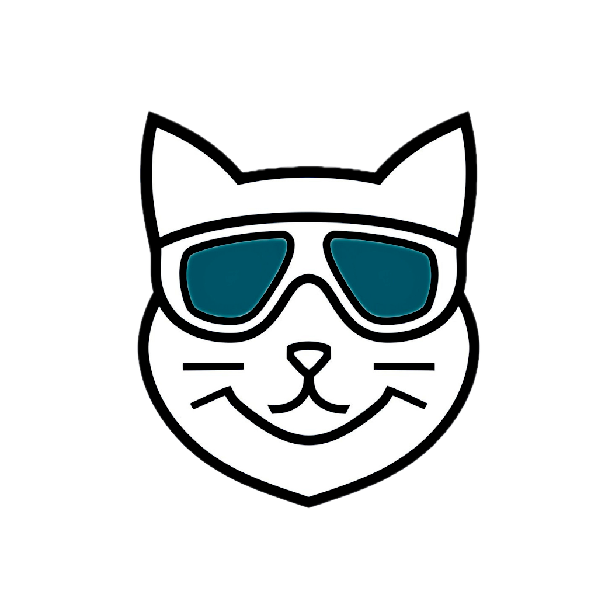

# AI Guardrails for Coding Assistants
<p align="left">
  
  <em>Paws before you push.</em>
</p>

 

AI assistants in VS Code, Cursor, and Windsurf read a `.github/copilot-instructions.md` file for project-specific guidance—but most teams leave it empty. Drop in these guardrails to catch dangerous patterns that cause **outages, security vulnerabilities, and secret leaks.**

Built by [Catpilot.ai](https://catpilot.ai)—born from a real incident where an AI assistant wiped production environment variables with a partial YAML update. MIT licensed. Dogfooded daily. PRs welcome.

## IDE Support

| IDE | Supported |
|-----|-----------|
| VS Code + GitHub Copilot | ✅ |
| Cursor | ✅ |
| Windsurf | ✅ |
| JetBrains + AI Assistant | ✅ |

## What It Catches

- ☁️ **Cloud CLI safety** (Azure, AWS, GCP) — query before modify, confirm before execute
- 🔑 **Secret detection** — 40+ patterns (Stripe, AWS, GitHub tokens, etc.)
- 🗄️ **Database safety** — transactions, previews, no DELETE without WHERE
- 🏗️ **Terraform/IaC** — plan before apply, no `-auto-approve`
- ☸️ **Kubernetes/Helm** — dry-run and diff before applying
- 📦 **Git safety** — no force-push to protected branches
- 🛡️ **Secure coding** — OWASP Top 10, input validation, output encoding
- 🧩 **Framework patterns** — Next.js, Django, Rails, FastAPI, Spring Boot, Express

**Example: Cloud CLI protection**

Without guardrails:
```bash
# AI runs this — looks fine, right?
az containerapp update --yaml partial-config.yaml
# 💥 Result: CPU reset to 0.5, memory to 1GB, all env vars deleted
```

With guardrails:
```bash
# AI queries current state first
az containerapp show --name myapp --query "properties.template"
# Shows you the full command and asks for confirmation before executing
# Prepares rollback command in case something goes wrong
```

<details>
<summary><strong>More examples</strong></summary>

**Command Injection prevention**

Without guardrails:
```python
# AI generates this — user controls filename
os.system(f"convert {filename} output.png")
# 💥 Attacker passes: "image.png; rm -rf /"
```

With guardrails:
```python
# AI uses subprocess with list (no shell interpretation)
subprocess.run(["convert", filename, "output.png"], check=True)
```

**SQL Injection prevention**

Without guardrails:
```python
# AI generates this
query = f"SELECT * FROM users WHERE id = {user_id}"
cursor.execute(query)
```

With guardrails:
```python
# AI uses parameterized queries
query = "SELECT * FROM users WHERE id = %s"
cursor.execute(query, (user_id,))
```

**Secret detection**

Without guardrails:
```python
# AI hardcodes credentials
API_KEY = "sk_live_abc123..."
stripe.api_key = API_KEY
```

With guardrails:
```python
# AI uses environment variables
import os
stripe.api_key = os.environ["STRIPE_API_KEY"]
```

</details>

## Quick Start

```bash
git submodule add https://github.com/catpilotai/catpilot-ai-guardrails.git .github/ai-safety
./.github/ai-safety/setup.sh
git add .gitmodules .github/
git commit -m "Add AI guardrails"
```

That's it. Your AI assistant now follows the safety rules.

<details>
<summary><strong>🧩 Framework Detection (Automatic)</strong></summary>

The setup script auto-detects your framework and adds relevant security patterns:

| Detected File | Framework |
|---------------|-----------|
| `package.json` with `"next"` | Next.js |
| `manage.py` or `requirements.txt` with `django` | Django |
| `Gemfile` with `rails` | Rails |
| `requirements.txt` with `fastapi` | FastAPI |
| `pom.xml`/`build.gradle` with `spring` | Spring Boot |
| `package.json` with `"express"` | Express |

```bash
# Auto-detect (recommended)
./.github/ai-safety/setup.sh

# Override detection
./.github/ai-safety/setup.sh --framework django

# Skip framework patterns
./.github/ai-safety/setup.sh --no-framework
```

Each framework adds ~600-800 bytes of security patterns specific to that stack.

</details>

<details>
<summary><strong>📁 For Organizations (Fork-based workflow)</strong></summary>

For teams that want to customize rules or control updates:

### Step 1: Fork This Repo

Fork `catpilotai/catpilot-ai-guardrails` to your organization (e.g., `YOUR_ORG/ai-guardrails`).

### Step 2: Add Submodule to Your Repos

```bash
git submodule add git@github.com:YOUR_ORG/ai-guardrails.git .github/ai-safety
```

### Step 3: Run Setup & Commit

```bash
./.github/ai-safety/setup.sh
git add .gitmodules .github/
git commit -m "Add AI guardrails"
```

### Customizing Rules

Add company-specific rules by editing the "🎯 Project-Specific Rules" section at the bottom of `copilot-instructions.md` in your fork.

### Staying Up to Date

```bash
cd your-fork-of-ai-guardrails
git fetch upstream    # git remote add upstream https://github.com/catpilotai/catpilot-ai-guardrails.git
git merge upstream/main
git push
```

Then in each repo:
```bash
git submodule update --remote .github/ai-safety
./.github/ai-safety/setup.sh --force
git commit -m "Update AI guardrails"
```

</details>

## Files

| File | Purpose |
|------|---------|
| `copilot-instructions.md` | Condensed rules (~4KB) — **auto-loaded by IDE** |
| `FULL_GUARDRAILS.md` | Complete reference (~20KB) — detailed examples, loaded on-demand |
| `frameworks/` | Framework-specific patterns (auto-detected) |

<details>
<summary><strong>How the two files work together</strong></summary>

The condensed `copilot-instructions.md` is automatically injected into every AI request by your IDE. The complete `FULL_GUARDRAILS.md` is NOT auto-loaded (too large), but the AI can read it when encountering edge cases or when you ask explicitly.

This approach optimizes for minimal context window usage while keeping complete documentation available.

</details>

## Cloning Repos With This Submodule

```bash
git clone --recurse-submodules <repo-url>

# Or if already cloned:
git submodule update --init --recursive
```

## Contributing

See [CONTRIBUTING.md](CONTRIBUTING.md) for guidelines on adding patterns and submitting PRs.

## License

MIT — See [LICENSE](LICENSE) for details.
