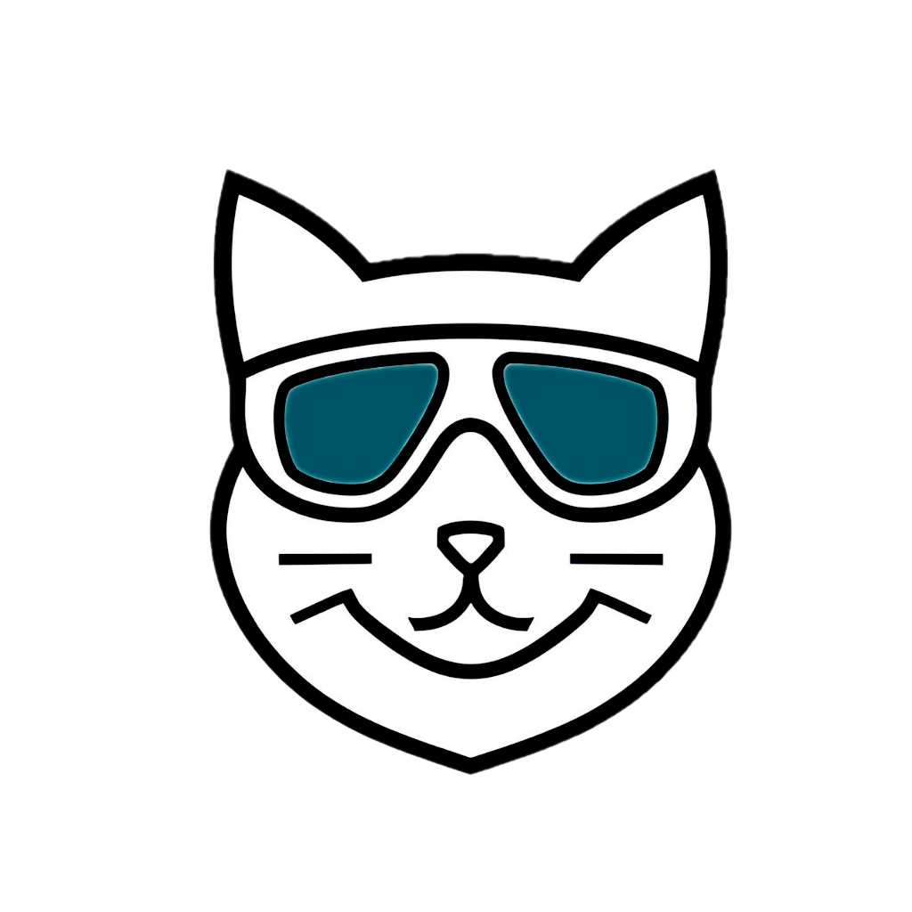

# Catpilot Security Skills

<p align="left">
  
  <em>Paws before you push.</em>
</p>

  

Portable security instructions for AI coding agents, distributed as an Agent Skills bundle. Start with the baseline below, then verify installation and behavior in your chosen host. The first targets for the new evaluation program are **Codex and Claude Code**; that is an evaluation priority, not a claim of verified protection.

Born from a real incident where an agent wiped production environment variables with a partial YAML update. The rules draw on incidents like that one and are used at [Catpilot.ai](https://catpilot.ai). They are MIT-licensed guidance, not a guarantee that an agent will follow them.

This repository is the portable baseline, not the Catpilot hosted platform. It contains no Catpilot MCP service, runtime interception layer, or managed enforcement agent. Read the [protection contract](docs/PROTECTION_CONTRACT.md) before treating the skill as a security control.

## Install

```bash
npx skills add catpilotai/catpilot-ai-guardrails --skill catpilot-security-core
```

Installation makes the instructions available to a compatible host. It does **not** prove they were loaded, followed, or enforced. Confirm the installed version, then test representative safe and unsafe tasks in an isolated environment.

The [skills.sh CLI](https://skills.sh) (`vercel-labs/skills`) handles installation for its supported hosts. Installer compatibility is separate from Catpilot's behavioral validation. Host configuration, activation, permissions, and versions affect what actually happens.

## Public Baseline vs Team Memory

The open-source skill is static and inspectable. It does not call Catpilot services or send telemetry. Review any skill before installing it; your AI host's own data handling and permissions still apply.

The separate Catpilot platform provides training/coaching and team-memory workflows. A company-specific companion is being explored; this OSS repository does not establish which hosted connectors or managed-delivery features are deployed for a customer. The intended workflow is:

1. Ingest events from individually verified integrations.
2. Offer focused coaching in the person's actual work surface.
3. Propose a reusable lesson for an authorized policy owner's review.
4. Distribute approved guidance through a verified private channel.
5. Distinguish approval, publication, installation, activation, and observed outcomes in the records.

Do not put private incidents, customer data, secrets, employee identifiers, or internal policy excerpts into this public baseline. Keep company overlays in verified private storage; a fork of a public repository is not a private distribution mechanism. Never turn an unreviewed event or document into an authoritative company rule automatically.


## What's in the box

`catpilot-security-core` contains **9 components** as of `2026.05.17`, intended to guide code generation, file edits, and shell commands. “Always-on” in older content describes intended use, not a runtime guarantee.

| Component | Severity | Guidance covers |
|---|---|---|
| **secret-blocking** | critical | Hardcoded API keys, tokens, passwords, private keys, OAuth secrets, JWT signing keys, database URLs with embedded credentials. |
| **cloud-cli-safety** | critical | Partial-YAML resets (Azure, AWS, GCP), `terraform apply -auto-approve` against prod state, `kubectl delete namespace`, `helm upgrade` without diff, recursive S3 deletes — with a six-step review protocol for cloud changes. |
| **database-safety** | critical | Destructive database operations, unscoped row changes, prod migrations without dry-run, raw SQL string interpolation, schema changes without transactional safety, locking DDL on hot tables. |
| **local-cli-safety** | critical | `rm -rf` near `/` or `$HOME`, `find -delete` on broad scopes, `dd` to block devices, `chmod -R 777`, force-push to shared branches, mass-rewrite over agent/SSH/cloud-credential paths. |
| **docker-safety** | critical | `--privileged`, host network, `-v /:/host`, root user in container, secrets baked into image layers, `:latest` tags, untrusted base images, build-args used for sensitive values. |
| **secrets-management** | critical | `.env` committed, secrets in CI logs / URL query strings / error messages, long-lived static keys where short-lived/OIDC works, secret reuse across environments, missing rotation cadence. |
| **supply-chain** | high | `curl \| bash` installers, unpinned dependencies, GitHub Actions on `@main` or floating tags instead of SHAs, typosquats, post-install scripts, unvetted agent skills / MCP servers / IDE extensions. |
| **pii-and-test-data** | high | Real customer data in tests/fixtures/comments/docs, prod DB dumps to dev, full request-body logging, real-PII in LLM prompts and fine-tuning sets, demos against real customer accounts. |
| **language-baseline** | high | SQL injection (concatenation, f-strings), command injection (`shell=True`), XSS (`innerHTML`, `document.write`), path traversal, insecure deserialization (`pickle`, `yaml.load`, `Marshal`, `ObjectInputStream`), `eval`/`Function`/`setTimeout(string)`, TypeScript `as any` escape hatches, SSRF (unvalidated outbound URLs, cloud metadata at `169.254.169.254`). |

Components carry control references for **SOC 2, PCI-DSS, ISO 27001, NIST CSF, and OWASP Top 10**, with severity, suggested evidence patterns, and worked negative examples. These references do not establish compliance, current control applicability, or that a check ran. Review mappings against the relevant standard version and customer scope.

## Format

Skills use the [Anthropic Agent Skills](https://agentskills.io/specification) format exactly. A skill is a directory containing a `SKILL.md` file with YAML frontmatter and a markdown body. Catpilot extensions (severity, control mappings, applies-to, evidence patterns) live under `metadata.catpilot.*`, which other runtimes ignore.

A recognized file layout helps distribution; it does not guarantee that a host loads every instruction or reference. Follow the host's current installation guidance and record the activation and behavioral checks you actually perform.

## Other ways to install

```bash
# Install globally so every project picks it up
npx skills add catpilotai/catpilot-ai-guardrails --skill catpilot-security-core --global

# Pick a specific agent (skills.sh defaults to detecting installed agents)
npx skills add catpilotai/catpilot-ai-guardrails --skill catpilot-security-core --agent cursor

# List what's available without installing
npx skills add catpilotai/catpilot-ai-guardrails --list

# Or skip the CLI entirely — just copy the skill in by hand
git clone https://github.com/catpilotai/catpilot-ai-guardrails.git
cp -r catpilot-ai-guardrails/skills/catpilot-security-core ~/.claude/skills/
```

### Hermes Agent

[Hermes Agent](https://hermes-agent.nousresearch.com) (Nous Research) has its own native skills system that reads from skills.sh. From inside Hermes:

```
/skills install catpilotai/catpilot-ai-guardrails/catpilot-security-core
```

## Versioning

- **Repository releases** are CalVer (`YYYY.MM.DD`). Current release: **`2026.09.11`**.
- **Source skill components** inside a release are semver — each component currently at `1.0.0`. The release frontmatter records which versions of which components shipped.
- The `2026.09.11` release adds the **evaluation foundation and protection contract**, not new runtime protections. The installed `catpilot-security-core` bundle remains at `2026.05.17`; no live-host behavioral benchmark is included.
- The `2026.06.25` release adds **framework-level** agentic/OpenClaw guardrails (tool-loop discipline, cron idempotency, workflow retry budgets, skill supply-chain kill chain, skill provenance). The nine `catpilot-security-core` components are unchanged from `2026.05.17`.

CalVer matches the cadence of a content repo: each release is a dated snapshot, and the date is the meaningful signal for users and auditors. Semver on individual components carries the breaking-change semantics that matter for downstream consumers.

## How it's built

```
src/skills/             # source components (semver, edited by hand)
  core/
    bundle.toml         # tier config: name, version, description
    secret-blocking/
      SKILL.md          # one component
    cloud-cli-safety/
      SKILL.md
skills/                 # shipped bundles (CalVer, generated)
  catpilot-security-core/
    SKILL.md            # what `npx skills add` installs
tools/
  bundle.py             # deterministic bundler
docs/spec/              # format spec, packaging spec, V2 postmortem
```

`tools/bundle.py` reads source components, aggregates frontmatter (severity = max, control mappings = sorted union, `applies_to` = union with `any` collapse), concatenates bodies in lexicographic order, and writes the shipped bundle. CI runs `python tools/bundle.py --check` on PRs affecting bundle inputs, outputs, or its workflow — if `skills/` drifts from `src/skills/`, the build fails with a unified diff.

## Evaluation foundation

The [synthetic scenario corpus](evals/cases.json) covers safe and unsafe app-building decisions, policy uncertainty, and unavailable protection. Its [evaluation guide](evals/README.md) defines how to assess Codex and Claude Code without confusing a model's assurance with a verified outcome.

```bash
# Offline fixture structure, coverage, and reference checks; no model calls
python3 tools/validate_evals.py
python3 -m unittest discover -s tests -v
```

These commands validate the **test inputs**, not agent behavior. No Codex/Claude Code behavioral pass rate or enforcement result is established by this first increment. The published cases are a development set, not a held-out benchmark.

## Contributing

PRs welcome — propose a new rule, fix a false positive, add a control mapping, port a v2.x rule into a source skill.

- Read [`docs/spec/SKILL_FORMAT.md`](./docs/spec/SKILL_FORMAT.md) for the frontmatter shape.
- Read [`docs/spec/PACKAGING.md`](./docs/spec/PACKAGING.md) for tier conventions and bundler aggregation rules.
- Run `python tools/bundle.py` before pushing; the CI gate is strict.
- See [`CONTRIBUTING.md`](./CONTRIBUTING.md) for the rest.

## Roadmap

The nine-component content baseline is shipped. The next increment is evaluation and trustworthy delivery, not a claim that security coverage is complete.

| Tier | Bundle | Status |
|---|---|---|
| Core guidance | `catpilot-security-core` | **shipped — 9 components (`2026.05.17`); not enforced by this repository** |
| Framework extensions | `catpilot-django-security`, `catpilot-fastapi-security`, `catpilot-rails-security`, `catpilot-express-security`, `catpilot-nextjs-security`, `catpilot-springboot-security`, `catpilot-docker-security` | planned (content exists in `frameworks/`, migrating into source skills) |
| Advanced (multi-agent / opt-in) | `catpilot-security-advanced` | planned |

Near-term order:

1. Establish the protection contract and synthetic evaluation corpus.
2. Record baseline behavior in isolated Codex and Claude Code sessions.
3. Improve the safe-building workflow and company-overlay format against observed failures.
4. Add one tested host integration and a narrowly scoped, verifiable check.

The standalone skill validator (`tools/validate-skill.py`), framework-detection helper (`tools/recommend.py`), new framework bundles, and further control mappings remain future work. The offline evaluation validator added here is not a skill validator or a security scanner.

## License

MIT. See [LICENSE](./LICENSE).

## Security

Found something dangerous? See [SECURITY.md](./SECURITY.md). For specific vulnerabilities, email **hi@catpilot.ai**.
